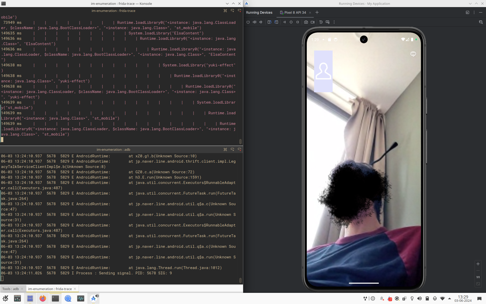

# Enumeration

## Next steps

* [x] Dynamic analysis with frida. Play with the app inside an emulator with frida
    connected, see if there is a way to check which libraries are executed when messages,
    calls, audio, etc are send/received.
* [] Enhance database information with additional information and euristhics:
  - Closed/Open source library.
  - Language/Compiler used.
  - Security measures in place.
  - Something else.
* [] Automatic static analysis on other IM apps apks.
* [] Check standard android libraries (?).

## LINE

### Static Analysis

I've started enumerating LINE. I've downloaded the APK from internet, and
extracted the sources+resources with:

```
apktool decode -f line-14-8-0.apk
```

I've also downloaded the app on the phone, and then extracted the APK, but
somehow the libraries are missing in the extracted APK. But I can see that they
are used in the source code, probably the apk extractor missed the bundle
configuration or something (todo for later).

With radare2/r2pipe I've automatically extracted the symbols and exports information of
these libraries.

```
python3 enumeration.py
```

The script also create/populate a sqlite database called `line.db` with data.
The libraries are only available for arm64-v8a and armeabi-v7a.

<details>
<summary>Libraries:</summary>

- ./libc++_shared.so (https://developer.android.com/ndk/guides/cpp-support)
- ./libaesgcmsiv_jni.so (https://github.com/line/aes-gcm-siv)
- ./libyoga.so (https://github.com/facebook/yoga)
- ./libElsaWeb.so
- ./libpqul.so
- ./libcrypto3line.so
- ./libyuki-camera-effect.so
- ./libElsaKit.so
- ./libimage_processing_util_jni.so
- ./libluacore.so
- ./libElsaImageProcessing.so
- ./libElsaAudio.so
- ./libopencv_core.so
- ./libandromeda-renderengine.so
- ./libElsaStoryboard.so
- ./libtask_vision_jni_gms.so
- ./libboost_filesystem.so
- ./libandromeda.so
- ./libElsaMedia.so
- ./libssid_liveness_jni.so
- ./libElsaImageLoaderAndroid.so
- ./libElsaEmlVariant.so
- ./libElsaBase.so
- ./libElsaContent.so
- ./libopengljni.so
- ./libElsaImageLoader.so
- ./libvana_jni.so
- ./libmm.so
- ./libcardioDecider.so
- ./libElsaImage.so
- ./libtensorflowlite_c.so
- ./libElsaDetection.so
- ./libElsaEngine.so
- ./libcardioRecognizer_tegra2.so
- ./libsjpeg-drawable.so
- ./liblanguage_id_l2c_jni.so
- ./libElsaImageLoaderBasis.so
- ./libapng-drawable.so
- ./libkuru.so
- ./liblegy.so
- ./libElsaMultiplexer.so
- ./libEffekseer.so
- ./libhecate-lib.so
- ./libopencv_highgui.so
- ./libimage-utils.so
- ./libboost_date_time.so
- ./libElsaConfig.so
- ./libElsaMediaKit.so
- ./libElsaPlatform.so
- ./libyuki-effect.so
- ./libcardioRecognizer.so
- ./libElsaDataSet.so
- ./libdummy_for_prebuilts.so
- ./liblinecall-filter.so
- ./libElsaGraphics.so
- ./liblua.so
- ./libYFLKit-jni.so
- ./libElsaDataVariant.so
- ./libstmobile_jni.so
- ./libclovaeyes-android.so
- ./libyuki-filter.so
- ./libElsaImageLoaderJpg.so
- ./libElsaARMain.so
- ./libsbclib.so
- ./libEffekseerRendererElsa.so
- ./libcard-detector.so
- ./libElsaDispatcher.so
- ./libboost_system.so
- ./libst_mobile.so
- ./libnelo2bridge.so
- ./libElsaImageLoaderPng.so
- ./libllvmliveness.so
- ./libElsaFile.so
- ./libtrimatch-native-lib.so
- ./libsqlcipher.so
- ./libElsaProfiling.so
- ./libopencv_imgproc.so
- ./libltsm.so
- ./libElsaFilePackage.so
- ./libElsaMultiplexerKit.so
- ./libssl3line.so
</details>

### Dynamic Analysis

I've installed android studio and used a virtual device with android 14.
I've downloaded frida-server from the frida's release page and uploaded it on
the device.

```sh
adb root
adb push frida-server-x86_64 /data/local/tmp/
adb shell "chmod 755 /data/local/tmp/frida-server-x86_64"
adb shell "/data/local/tmp/frida-server-x86_64 &"
```

Now we can use frida-trace to trace the loaded libraries.

```
frida-trace -U -F LINE -j '*!*loadLibrary*' # If LINE is already running
frida-trace -U -f jp.naver.line.android -j '*!*loadLibrary*' # If you want to spawn LINE
```

To be able to message with a contact the only working option from the emulator
is to scan a QR code. I've downloaded LINE on my phone and uploaded the QR code
of my phone's account into the emulated device.

When starting a call between two users the libraries loaded are:

- libandromeda.so, libandromeda-rendering.so: They use webrtc and protobuf
- /libst_mobile.so
- /libstmobile_jni.so
- /libElsaContent.so
- /libyuki-effect.so
- /libyuki-camera-effect.so
- /libyuki-filter.so

They are all probably loaded from `sources/com/linecorp/yuki/effect/android/YukiNativeLoader.java`:

```java
final class YukiNativeLoader {
    ...

    @Keep
    public static synchronized boolean loadLib(String str) {
        boolean z12;
        boolean z13;
        synchronized (YukiNativeLoader.class) {
            boolean z14 = true;
            boolean loadLib = KuruNativeLoader.isLibLoaded() ? true : KuruNativeLoader.loadLib(str);
            if (str != null) {
                System.load(str.concat("/libst_mobile.so"));
                System.load(str.concat("/libstmobile_jni.so"));
                System.load(str.concat("/libElsaContent.so"));
                System.load(str.concat("/libyuki-effect.so"));
                System.load(str.concat("/libyuki-camera-effect.so"));
                System.load(str.concat("/libyuki-filter.so"));
                z12 = true;
            } else {
                z12 = false;
            }
            if (z12) {
                z14 = z12;
            } else {
                System.loadLibrary(STNativeFactory.LIB_NAME_ST_MOBILE);
                System.loadLibrary(STNativeFactory.LIB_NAME_ST_MOBILE_JNI);
                System.loadLibrary("ElsaContent");
                System.loadLibrary("yuki-effect");
                System.loadLibrary(YukiCameraEffectNativeFactory.LIB_NAME_CAMERA_EFFECT);
                System.loadLibrary("yuki-filter");
            }
            z13 = z14 & loadLib;
            f152287a = z13;
        }
        return z13;
    }
```

To have a functioning videocall is necessary (?) to use the laptop's webcam
as the front camera/back camera of the emulated device.



Other libraries that are used when starting the application are:

- ./libpqul.so
- todo

I still don't get how the main `Elsa` libraries are loaded. Grepping through the code:

```
$ rg -F "System.loadLibrary"

sources/com/linecorp/elsa/ElsaMediaKit/ElsaMediaBase.java:            System.loadLibrary("c++_shared");
sources/com/linecorp/elsa/ElsaMediaKit/ElsaMediaBase.java:            System.loadLibrary("ElsaMediaKit");
sources/com/linecorp/elsa/ElsaMediaKit/ElsaMediaKitController.java:            System.loadLibrary("c++_shared");
sources/com/linecorp/elsa/ElsaMediaKit/ElsaMediaKitController.java:            System.loadLibrary("ElsaMediaKit");
sources/com/linecorp/elsa/content/android/util/LibHelper.java:            java.lang.System.loadLibrary(r2)     // Catch: java.lang.Throwable -> L30
sources/com/linecorp/elsa/ElsaKit/sensetime/SenseTimeNative.java:            System.loadLibrary(STNativeFactory.LIB_NAME_ST_MOBILE);
sources/com/linecorp/elsa/ElsaKit/ElsaNetworkControl.java:        System.loadLibrary("c++_shared");
sources/com/linecorp/elsa/ElsaKit/ElsaNetworkControl.java:        System.loadLibrary("ElsaKit");
sources/com/linecorp/elsa/ElsaKit/ElsaBeautyValueManager.java:            System.loadLibrary("c++_shared");
sources/com/linecorp/elsa/ElsaKit/ElsaBeautyValueManager.java:            System.loadLibrary("ElsaKit");
sources/com/linecorp/elsa/ElsaKit/ElsaCustomDataEffectDelegate.java:            System.loadLibrary("c++_shared");
sources/com/linecorp/elsa/ElsaKit/ElsaCustomDataEffectDelegate.java:            System.loadLibrary("ElsaKit");
sources/com/linecorp/elsa/ElsaKit/ElsaController.java:            System.loadLibrary("c++_shared");
sources/com/linecorp/elsa/ElsaKit/ElsaController.java:            System.loadLibrary("ElsaKit");
sources/com/linecorp/elsa/ElsaKit/base/ElsaLog.java:            System.loadLibrary("c++_shared");
sources/com/linecorp/elsa/ElsaKit/base/ElsaLog.java:            System.loadLibrary("ElsaKit");
sources/com/linecorp/elsa/ElsaKit/ElsaVersionService.java:            System.loadLibrary("c++_shared");
sources/com/linecorp/elsa/ElsaKit/ElsaVersionService.java:            System.loadLibrary("ElsaKit");
sources/com/linecorp/elsa/ElsaKit/ElsaColorCorrectionEffectDelegate.java:            System.loadLibrary("c++_shared");
sources/com/linecorp/elsa/ElsaKit/ElsaColorCorrectionEffectDelegate.java:            System.loadLibrary("ElsaKit");
sources/com/linecorp/yuki/effect/android/YukiNativeLoader.java:                System.loadLibrary("ElsaContent");
```

`ElsaMediaKit` and `ElsaKit` are the two main `Elsa` libraries that are used,
additionally they also import all the other libraries.

I could find lots of references of `Elsa` in parts of code that are handling
the `Beauty` and `Effects`. One thing that I wasn't able to get was
face filters on the emulated device, and the camera view looks different and
with less options compared to my smartphone's view.

## Viber

The nice thing about viber is that the libraries are available both for ARM and
for x86_64.

<details>
<summary>Libraries:</summary>

- libViberRTC.so
- libimage_processing_util_jni.so
- libcrashlytics-trampoline.so
- libyoga.so
- libsigner.so
- libgifimage.so
- libnative-filters.so
- libfolly_json.so
- libtensorflowlite_gpu_jni.so
- libsvg.so
- libhermes.so
- liblinkparser.so
- libpl_droidsonroids_gif.so
- libcamplat+.camkit.production.055ca520857ff8f81c1d77f288da4342a3664f62.so
- libjscexecutor.so
- libmux.so
- libtensorflowlite_jni.so
- libspeexjni.so
- libjingle_peerconnection_so.so
- libreactnativejni.so
- libc++_shared.so
- libVoipEngineNative.so
- libnativehttp.so
- libreactnativeblob.so
- librenderscript-toolkit.so
- libjsinspector.so
- libjsijniprofiler.so
- libcrashlytics-common.so
- libicuBinder.so
- libnative-imagetranscoder.so
- libsqliteX.so
- libFlatBuffersParser.so
- libcrashlytics.so
- libcrashlytics-handler.so
- libnloader.so
- libvideoconvert.so
- libfb.so
- libfolly_futures.so
- libCrossUnblocker.so
- libimagepipeline.so
- libhermes-executor-release.so
- libglog.so
- libfbjni.so
- libglog_init.so

</details>

Most of these libraries are developed by Facebook and are open source.
I don't think there is much here


## WeChat
- Custom parsers for voice / music / video
- Custom viewers
- QQ Browser for viewing files

```
frida -U -l .\wechat.js -f com.tencent.mm
```

<details>
<summary>Libraries:</summary>

- libframework-connectivity-jni.so
- libmmkv.so
- libtrace-canary.so
- libwechatnormsg.so
- libtsmsc.so
- libwechatcommon.so
- libmmimgcodec.so							Custom Library for Parsing Images
- libmmv8.so								QQ Browser ~ https://chromium.googlesource.com/v8/v8
- libflutter.so								Native Flutter Engine
- libTPThirdParties-master.so
- libTPFFmpeg-master.so
- libcso.so
- libdart2cpp.so
- libTPCore-master.so
- libcso.log.so
- libwxperf-tkill.so
- libmatrix-fd.so
- libwechatlv.so
- libmmskia.so								Custom Library for GUI
- libGPUDetector.so
- libhardcoder.so							~
- libwcwss.so								Custom Library for Web Sockets 
- libaff_biz.so
- libilink_network.so						~
- libmatrix-stack-tracer.so
- libilink2.so								~
- libowl.so
- libemojihelper.so							Custom Library for Parsing Emojis	
- liblinebreak.so							~
- libwechatWordDetectMod.so					Custom Library for Word Detection in Images
- libwechatQrMod.so							Custom Library for QR Code Creation / Detection
- libXNet.so
- libopencv_world.so						https://opencv.org/
- libffengine.so							Custom Library for Fast Focus Engine
- libfocusEngineJni.so
- libreadMoney.so
- libDownloadProxy.so						
- libtxmapengine.so							Custom Library for GUI
- libtencentlocsapp.so						Custom Library for Location Services
- libjnirtk.so								Library for GPS ~ https://github.com/tomojitakasu/RTKLIB
- libNLog.so								~
- libaudio_common.so						Custom Library for Media Player
- libFormatDetector.so
- libcodec_factory.so
- libqqmusic_decoder_jni.so					Custom Library for Parsing Audio
- libc++_shared.so							C++ Standard Library
- libstlport_shared.so						C++ Standard Library
- libwechatxlog.so							~
- libxffmpeg.so 							https://ffmpeg.org/
- libxlabeffect.so							Custom Library for Video Call Effects
- libxeffect_xlog.so						~
