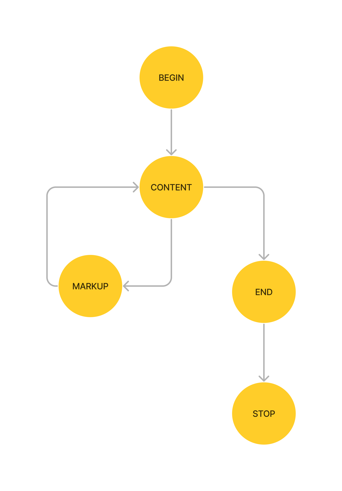
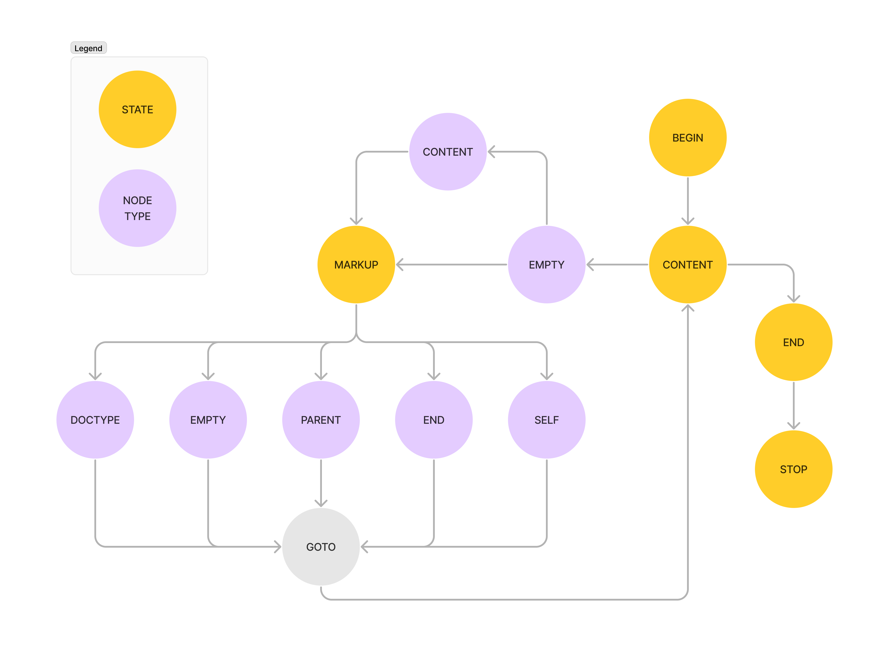

# Svg2Ass

## Test Crash

```
./binaries/svg2ass_sanitized < ./io/output_dir_<something>/default/crashes/<crash_file>
```

Run ./test_crash.sh (setting the right output directory of the crashes) to analyze
the `unique` crashes.

Example:

```
./test_crash.sh ./io/output_dir_frida_set/default/crashes/
```

## Security

TODO: Multiple bugs found on a run with AFL++.
Explain a bit the nature of the bugs (I actually don't know, maybe we don't care about it too much).

## Architecture

svg2ass has a simple Finite State Machine (FSM), that is defined in [./src/nxml.c](./src/nxml.c)`:nxmlParse()`:

```c
enum state state = ST_BEGIN;

// ...

while ( ST_STOP != state ) {
            switch ( state )
    {
    case ST_BEGIN:
        node.type = NXML_TYPE_EMPTY;
        res = cb( NXML_EVT_BEGIN, &node, usr );
        state = ST_CONTENT;
        break;
    case ST_END:
        node.type = NXML_TYPE_EMPTY;
        res = cb( NXML_EVT_END, &node, usr );
        state = ST_STOP;
        break;
    case ST_CONTENT:
        m = strchr( p, '<' );
        // do something else
        state = m ? ST_MARKUP : ST_END;
        break;
    case ST_MARKUP:
        m = parseMarkup( p, &node );
        // do something else
        state = ST_CONTENT;
    case ST_STOP:	/* no break */
    default:
        assert( 0 == 1 );
        break;
    }
    if ( res )
        state = ST_STOP;
}
```

The State Transition Graph (STG) of the program's `state` is:



We don't have much to guide our stateful fuzzer towards interesting states,
because there are only 5 states, and every svg image will go through these states.
However, the state of the program does not depend only on the main state `state`,
but also on:

- `node.type`: (NXML_TYPE_EMPTY, NXML_TYPE_CONTENT, NXML_TYPE_PARENT, ...)
- `node.name`: ("svg", "line", "circle", "rect", ...)
- `event`: (NXML_EVT_BEGIN, NXML_EVT_OPEN, NXML_EVT_CLOSE, ...)

and additional variables of our choice.

For this reason if we look at the STG by including the node.type we will see:



This is similar to the State Transition Tree that SGFuzz will build, that adhere to this rule:

> If there are multiple state variables, a node’s parent or children nodes can represent values of different state variables.

If we also add `node.name` we will see something more complex, because at every node.type we can have differents `node.name` possibilities, and for each different `node.name` the program
will execute a different set of functions.
For this reason, it makes to automatically capture these transitions.

