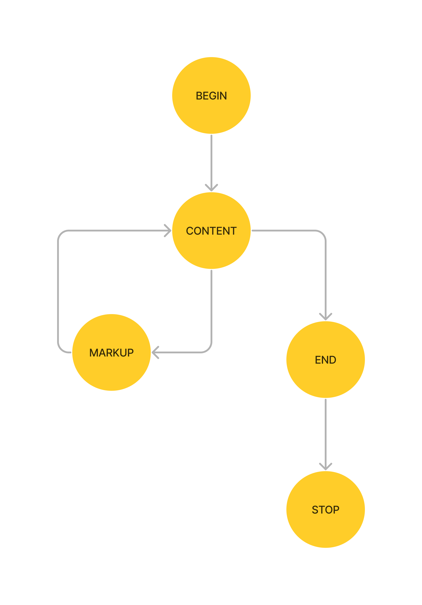
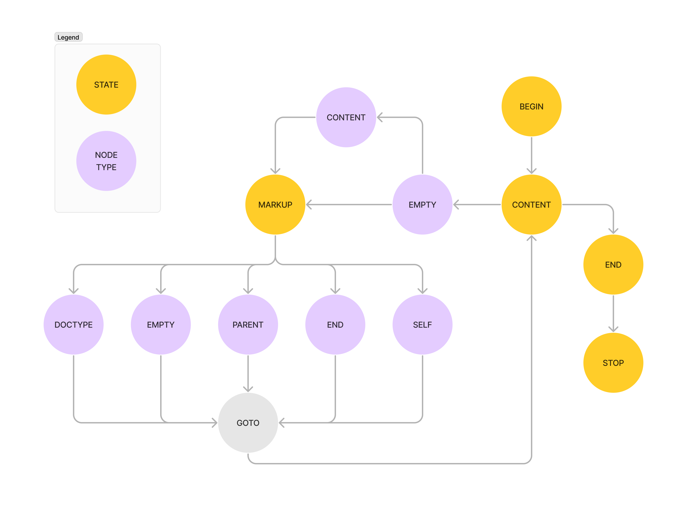
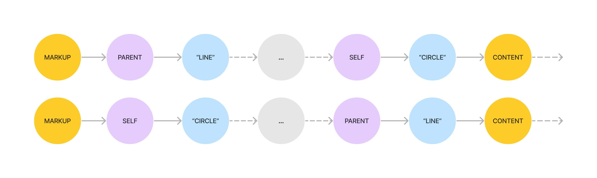
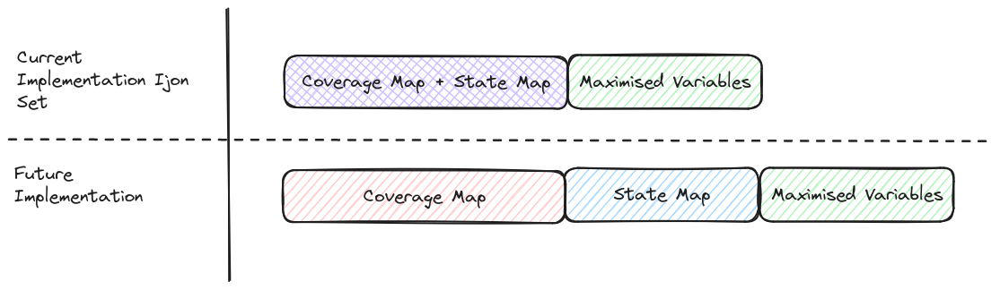

# Svg2Ass

## Test Crash

```
./binaries/svg2ass_sanitized < ./io/output_dir_<something>/default/crashes/<crash_file>
```

Run ./test_crash.sh (setting the right output directory of the crashes) to analyze
the `unique` crashes.

Example:

```
./test_crash.sh ./io/output_dir_frida_set/default/crashes/
```

## Security

TODO: Multiple bugs found on a run with AFL++.
Explain a bit the nature of the bugs (I actually don't know, maybe we don't care about it too much).

## Architecture

svg2ass has a simple Finite State Machine (FSM), that is defined in [./src/nxml.c](./src/nxml.c)`:nxmlParse()`:

```c
enum state state = ST_BEGIN;

// ...

while ( ST_STOP != state ) {
            switch ( state )
    {
    case ST_BEGIN:
        node.type = NXML_TYPE_EMPTY;
        res = cb( NXML_EVT_BEGIN, &node, usr );
        state = ST_CONTENT;
        break;
    case ST_END:
        node.type = NXML_TYPE_EMPTY;
        res = cb( NXML_EVT_END, &node, usr );
        state = ST_STOP;
        break;
    case ST_CONTENT:
        m = strchr( p, '<' );
        // do something else
        state = m ? ST_MARKUP : ST_END;
        break;
    case ST_MARKUP:
        m = parseMarkup( p, &node );
        // do something else
        state = ST_CONTENT;
    case ST_STOP:	/* no break */
    default:
        assert( 0 == 1 );
        break;
    }
    if ( res )
        state = ST_STOP;
}
```

The State Transition Graph (STG) of the program's `state` is:



## Fuzzer Optimizations

We don't have much to guide our stateful fuzzer towards interesting states,
because there are only 5 states, and every svg image will go through these states.
However, the state of the program does not depend only on the main state `state`,
but also on:

- `node.type`: (NXML_TYPE_EMPTY, NXML_TYPE_CONTENT, NXML_TYPE_PARENT, ...)
- `node.name`: ("svg", "line", "circle", "rect", ...)
- `event`: (NXML_EVT_BEGIN, NXML_EVT_OPEN, NXML_EVT_CLOSE, ...)

and additional variables of our choice.

For this reason if we look at the STG by including the node.type we will see:



This is similar to the State Transition Tree that SGFuzz will build, that adheres to this rule:

> If there are multiple state variables, a node’s parent or children nodes can represent values of different state variables.

If we also add `node.name` we will see something more complex, because at every node.type we can have differents `node.name` possibilities, and for each different `node.name` the program
will execute a different set of functions.
For this reason, it makes to automatically capture these transitions.

What we can do is to log each variable change in the main FSM loop and build a list:



In this case we have taken in consideration `state`, `node.type`, `node.name`.

Now we can create an hash value based on the last `N` elements of this list, and
pass it to our IJON set implementation. The problem is that we don't want to overwrite
(too many) values on the coverage map, so we want to limit the collisions.

At the moment the current implementation of the fuzzer is:



For this reason we can
use a sum of the last `N` elements of this list and then hash the result, in this way we
exploit the commumative property of the sum.

In the future we could explore the use of an additional `State Map`, to be able to
hash the state transition list without a commumative property and capture in a better
way the transition of the system.

Since the `node.name` property is user controllable we use a whitelist of possible
values to not overload the list with junk values.

Pseudocode:

```py
transition_list = []
valid_node_names = ["svg", "g", "", "line", "rect", "circle", "ellipse", "path", "polyline", "polygon"]

# addr: address inside the binary program
# n: how many elements to consider from the transition_list to compute the hash
hook_function(addr, n):
    states, node_name, node_type = get_variables()
    transition_list.append(node_type)
    transition_list.append(state)
    if node_name in valid_node_names:
        transition_list.append(node_names)

    hash_val = hash(sum(transition_list[-n:]))
    ijon_set(addr, hash_val)
```

## Crashes

### nxml.c parseMarkup Out-of-Bound Read Vulnerability

The vulnerability occurs within the `parseMarkup` function when called with a parameter value for p set to "\x00" (i.e. the end of a string). In this case the function first checks [*1*] the null terminator if it is a namestart, which returns true, and then it loops over [*2*] the characters following the null terminator thus leading to an out-of-bound read.

```c
static inline char *parseMarkup( char *p, nxmlNode_t *node )
{
       char *m = p;
       // ...
    
       if ( is_namestart( *m ) ) // match parent/self tag // 1
       {
                node->type = NXML_TYPE_PARENT;  // tentative!
                node->name = m;
                while ( is_namechar( *m ) ) // 2
                        ++m;
```

To reach this function the state machine of the parser needs to be within the `ST_MARKUP` state. To reach that state with the desired payload string, the original input string must end in the character "<", as it will be replaced by [*3*] the code seen below with a null terminator. 

```c
int nxmlParse( char *buf, nxmlCb_t cb, void *usr )
{
        // ...
        case ST_CONTENT:
                        m = strchr( p, '<' ); // 3
                        if ( m )
                                *m++ = '\0';
                        trim( p );
                        if ( *p )
                        {
                                node.type = NXML_TYPE_CONTENT;
                                node.name = p;
                                res = cb( NXML_EVT_TEXT, &node, usr );
                        }
                        state = m ? ST_MARKUP : ST_END;
                        break;
```

To trigger the out-of-bound read any input terminating in the "<" will work, such as `AAAAAAAA<`.

